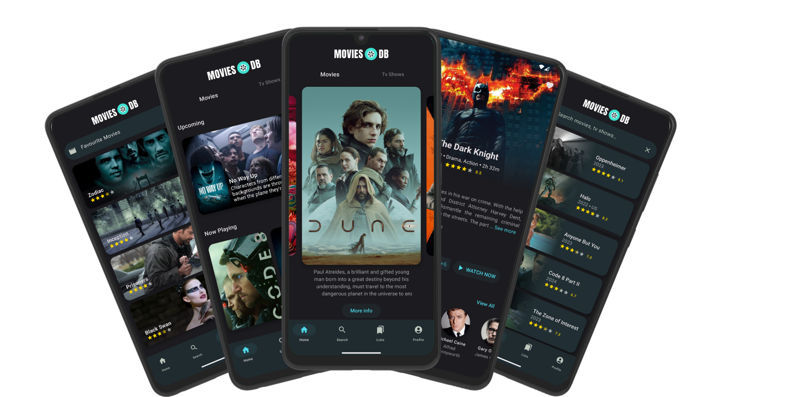

# MOVIES DB

A Jetpack Compose Android app utilizing TMDB API to showcase trending, upcoming, and popular movies and TV shows. It enables users to explore, track, and find streaming providers for movies and TV shows, while also displaying trailers and key details.

<p align="center">

</p>

## Setup Requirements
1. Get your own api key from [TMDB](https://developer.themoviedb.org/docs/getting-started)
2. Create local.properties and add:
    ```bash
    API_KEY="<YOUR_API_KEY>"
    ```

## Dependencies
- [Jetpack Components](https://developer.android.com/jetpack)
    - [Jetpack Compose](https://developer.android.com/jetpack/compose)- Modern Android UI toolkit for building native UIs using a declarative syntax.

    - [Android KTX](https://developer.android.com/kotlin/ktx.html) -  Android KTX is a set of Kotlin extensions that optimize Android development with Jetpack and other Android libraries.

    - [AndroidX](https://developer.android.com/jetpack/androidx) - AndroidX is a set of libraries that provides backward-compatible versions of Android framework APIs.

    - [Datastore](https://developer.android.com/topic/libraries/architecture/datastore) - Jetpack DataStore is a data storage solution that allows you to store key-value pairs or typed objects with protocol buffers.

    - [Paging3](https://developer.android.com/topic/libraries/architecture/paging/v3-overview) - Paging 3 is the Android Jetpack library which provides support for loading data in pages.

    - [Navigation](https://developer.android.com/guide/navigation) - Navigation component is a part of Android Jetpack that simplifies navigation.

    - [ViewModel](https://developer.android.com/topic/libraries/architecture/viewmodel) - ViewModel is a class designed to store and manage UI-related data in a lifecycle-conscious way.

- [MVI Architecture](https://developer.android.com/jetpack/compose/architecture) -  MVI (Model-View-Intent) Architecture is a unidirectional data flow architectural pattern commonly used in Android development for managing UI components and application state.

- [Coroutines](https://github.com/Kotlin/kotlinx.coroutines) - Kotlin coroutines provide support for asynchronous programming in Kotlin. They allow you to write asynchronous code sequentially, making asynchronous programming easier to read and write.

- [Flows](https://developer.android.com/kotlin/flow) - Kotlin Flows are a cold asynchronous data stream that sequentially emits values and completes normally or with an exception. They are built on top of Kotlin coroutines and designed to be efficient.

- [Hilt](https://dagger.dev/hilt/) - A dependency injection library for Android that reduces the boilerplate of doing manual dependency injection in your project.

- [Retrofit](https://square.github.io/retrofit/) - Retrofit is a type-safe HTTP client for Android and Java.

- [GSON](https://github.com/google/gson) - Gson is a Java library used for serializing and deserializing Java objects to and from JSON.

- [OkHttp Logging Interceptor](https://github.com/square/okhttp/blob/master/okhttp-logging-interceptor/README.md) - OkHttp Logging Interceptor is an OkHttp interceptor which logs HTTP request and response data.

- [Coil](https://github.com/coil-kt/coil) - Coil is an image loading library for Android backed by Kotlin Coroutines. It is designed to be fast, lightweight, and easy to use.

- [TMDB](https://developer.themoviedb.org) - The Movie Database (TMDB) is an online database that provides information about movies, TV shows, and celebrities, offering a comprehensive platform for media-related data.

- [Youtube Player](https://github.com/PierfrancescoSoffritti/android-youtube-player) - An Android library for embedding YouTube videos into applications with customizable playback options and features.